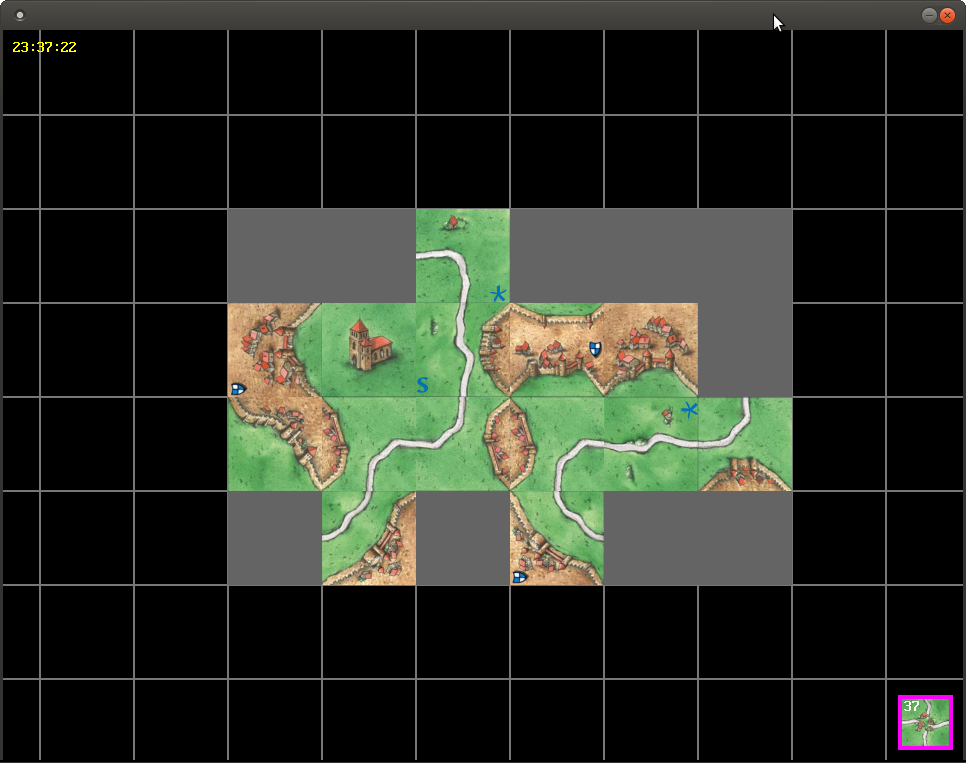
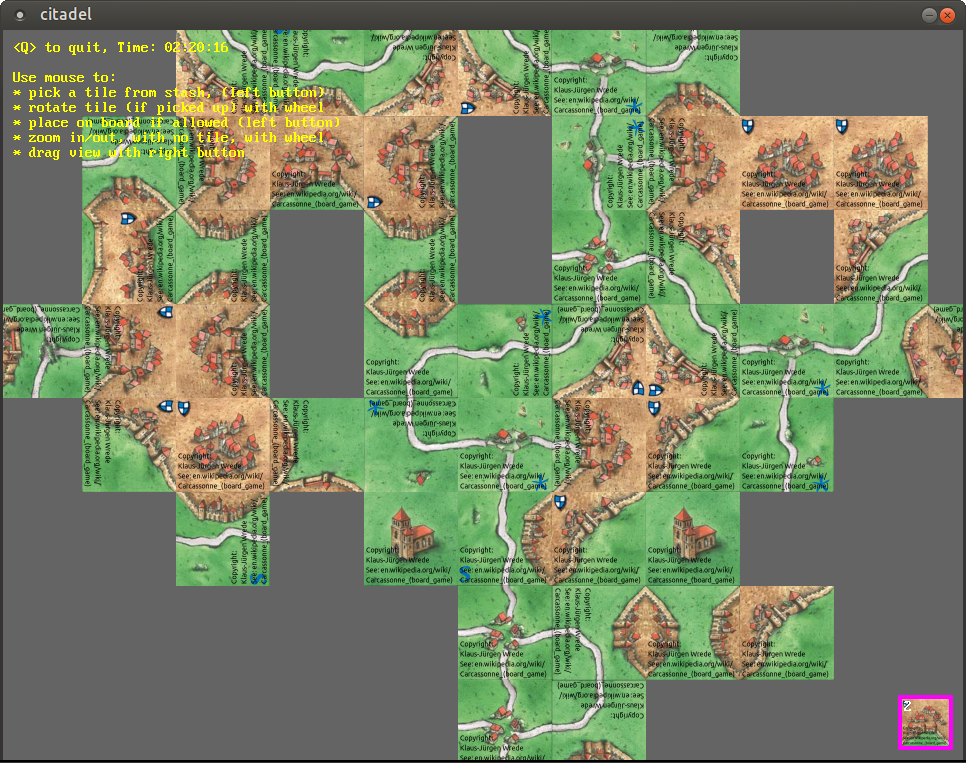

# fb_citadel_game
A Carcassonne / Dorfromantik inspired game in FreeBASIC
Work in progress...

# Gameplay

## Goal
Build a large land / board. Do not run out of tiles.

## Scoring / getting tiles
By completing structures:
* River: points = num tiles
* Road section: points = num tiles - 1
* City: points = (num tiles - 2) + 1 point per blazon / pennant
* Perfect tile (4 neigbours): 1 point
For each point scored you get 1 random tile added to the bottom of the stack

## Extra card places
Up to 3 extra places to save one card can be obtained by:
* Placing an abbey fully surounded by 8 tiles of any type
* Placing an abbey with 4 other abbey tiles next to it and 4 tiles of any type diagonal
* Placing an abbey fully surounded by 8 other abbey tiles

Like this:
<pre>'.....................
'...TTT...TAT...AAA...
'...TAT...AAA...AAA...
'...TTT...TAT...AAA...
'.....................</pre>

## Details
* Road sections end at crossings / t-junctions
* Rivers / waterways do not end at junctions.
* When completing 2 structures at once (e.g. city + road), the placed tile scores 2 points / tiles

# Controls

## Mouse
* [left mouse button] 'pick a tile from stack' or 'place on board if allowed'
* [mouse wheel] 'zoom in/out' or 'rotate tile if picked from stack'
* [right mouse button] + [mouse mouse] 'drag view' 

## Keyboard
* [Q] 'quit'
* [+/-] 'zoom in/out'

